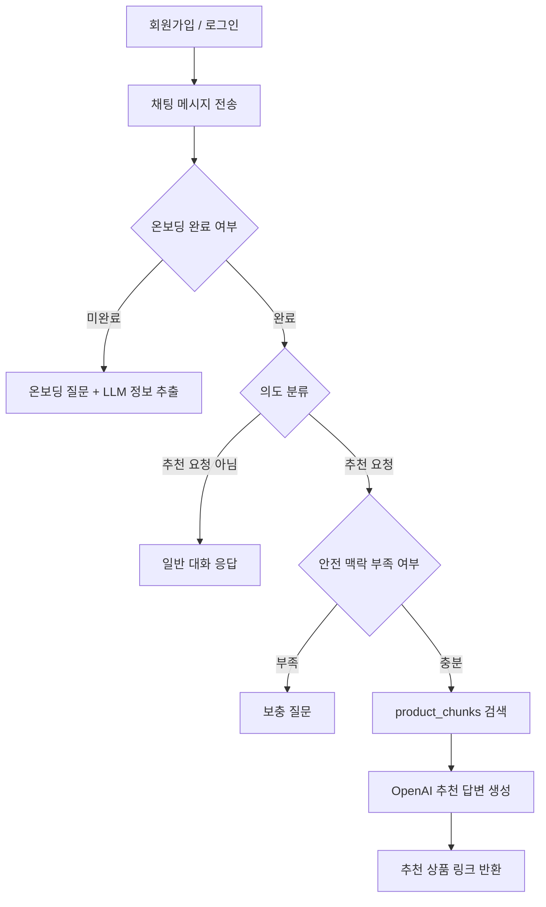

# Levit Assignment

AI 건강기능식품 추천/요약 에이전트 과제용 레포지토리입니다.

배포 링크: http://15.165.161.168

이번 과제에서는 한국의 35-50세 여성 소비자가 건강기능식품을 탐색할 때 느끼는 정보 탐색 비용과 불안감을 문제로 잡았습니다. 상품 상세 페이지, 리뷰, 성분 정보, 주의사항이 흩어져 있고 광고성 정보도 많기 때문에, 사용자가 “나한테 맞는 상품인지”를 빠르게 판단하기 어렵다고 보았습니다.

그래서 React, Node.js, MySQL, LangGraph.js, OpenAI API, RAG를 사용해 채팅형 추천 MVP를 구현했습니다. 유저는 회원가입/로그인 후 채팅방에서 자신의 건강 맥락을 온보딩으로 남기고, 이후 질문을 하면 수집한 상품 데이터와 개인 맥락을 함께 사용해 답변을 받습니다.

---

## 과제 요구사항 대응

| 요구사항 | 구현 내용 |
| --- | --- |
| React 사용 | `client/`에서 React 기반 채팅 UI 구현 |
| Node.js 사용 | `server/`에서 Express 기반 API 서버 구현 |
| ChatGPT API 활용 | 온보딩 정보 추출, 의도 분류, 추천 답변 생성에 OpenAI API 사용 |
| 크롤링 데이터 활용 | Pillyze 상품 HTML을 구조화한 `data/raw_products.json`을 Python pipeline으로 MySQL에 적재 |
| 사용자에게 콘텐츠 노출 | RAG가 `product_chunks`를 검색하고, 추천 답변과 상품 링크를 반환 |
| 호스팅 | EC2 단일 인스턴스에서 Docker Compose + nginx로 배포 |
| Github 제출 | 구현 의도와 실행 방법을 README/docs에 정리 |

---

## 핵심 기능

- 이메일 기반 회원가입/로그인
- JWT 기반 인증
- 채팅방 목록 조회와 메시지 조회
- 4단계 온보딩
  - 연령대/건강 고민
  - 임신/수유 및 지속 질환
  - 복용 중인 약/영양제
  - 생활패턴/주의 성분/섭취 선호
- LangGraph.js 기반 채팅 분기
  - 온보딩 미완료면 온보딩 질문
  - 온보딩 완료 후 추천 요청이면 RAG 검색
  - 추천 요청이 아니면 일반 대화 응답
  - 안전 맥락이 부족하면 보충 질문
- 상품 chunk 기반 RAG
- 추천 상품명, 브랜드, 원문 URL 반환
- Python 기반 상품 데이터 적재 pipeline

---

## Project Structure

```text
client/                 React chat UI
server/                 Node.js API server
pipeline/               Python product ingestion pipeline
data/raw_products.json  수집/구조화한 상품 데이터
deploy/nginx.conf       EC2 배포용 nginx reverse proxy 설정
docs/                   과제 설명 문서
```

서버는 기능 단위에 가깝게 나누었습니다.

```text
server/src/
├── domain
│   ├── auth
│   ├── chat
│   ├── onboarding
│   ├── product
│   ├── rag
│   └── user
└── global
    ├── config
    ├── db
    ├── llm
    └── vector
```

Spring Boot의 controller, service, repository 흐름은 참고하되, JavaScript 프로젝트에서 너무 많은 계층을 만들지는 않도록 했습니다. 처음에는 구조가 조금 낯설었지만, 기능별 domain을 기준으로 나누니 API, 온보딩, RAG의 책임을 나눠서 보기 쉬웠습니다.

---

## 전체 흐름



대화는 한 번에 바로 상품 추천으로 가지 않습니다. 먼저 온보딩을 통해 유저의 기본 맥락을 받고, 이후 메시지의 의도를 분류합니다. 추천 요청이면 RAG 검색을 수행하고, 단순 설명 요청이나 잡담이면 상품 검색을 하지 않고 대화형 응답으로 처리합니다.

건강기능식품은 복용 중인 약, 질환, 임신/수유 여부에 따라 조심해야 할 수 있기 때문에, 새로운 안전 맥락이 등장하면 바로 추천하지 않고 한 번 더 확인 질문을 하도록 했습니다.

---

## 문서

- [docs/01_Product_Strategy.md](./docs/01_Product_Strategy.md): 과제 1 문제 정의와 MVP 전략
- [docs/02_RAG_Architecture.md](./docs/02_RAG_Architecture.md): LangGraph/RAG 구조
- [docs/03_Data_Pipeline.md](./docs/03_Data_Pipeline.md): 상품 데이터 수집과 chunk 생성 방식
- [docs/04_API_Spec.md](./docs/04_API_Spec.md): API 명세와 채팅 API 흐름
- [docs/05_Deployment.md](./docs/05_Deployment.md): 배포 방향과 EC2 구성
- [docs/06_Runbook.md](./docs/06_Runbook.md): 로컬 실행, 데이터 적재, 배포, 테스트 방법

---

## QA 시나리오

아래 순서로 배포된 서비스를 확인할 수 있습니다.

1. 배포 링크에 접속합니다.
2. 이메일, 닉네임, 비밀번호로 회원가입합니다.
3. 새 채팅방에서 온보딩 질문 4단계에 답합니다.
4. “요즘 피곤하고 잠을 잘 못 자는데 추천해줘”처럼 추천 질문을 입력합니다.
5. 답변에 추천 이유, 주의할 점, 추천 상품 링크가 포함되는지 확인합니다.
6. “왜 그렇게 추천했어?”처럼 설명 요청을 입력해 RAG 반복 추천이 아닌 대화형 응답이 나오는지 확인합니다.
7. “혈압약을 먹고 있어도 괜찮아?”처럼 안전 맥락을 입력해 추가 확인 질문이 나오는지 확인합니다.

---

## 구현하면서 중요하게 본 점

첫 번째는 온보딩과 추천을 분리한 점입니다. 처음부터 상품 추천으로 들어가면 사용자의 질환, 복용약, 임신 여부 같은 맥락을 놓칠 수 있기 때문에, 최소한의 질문을 먼저 받도록 했습니다. 단순히 “피로에 좋은 영양제 추천”이 아니라 “40대 여성, 갑상선약 복용, 수면 부족” 같은 맥락을 추천에 같이 넣고 싶었습니다.

두 번째는 추천 요청이 아닌 말까지 RAG로 보내지 않도록 한 점입니다. 테스트 중에 사용자가 “왜 똑같이 말해?”처럼 말해도 계속 추천 답변이 반복되는 문제가 있었습니다. 이 문제를 해결하기 위해 LangGraph에 의도 분류 노드를 추가했고, 추천 요청이 아닌 경우에는 일반 대화 응답으로 빠지도록 수정했습니다.

세 번째는 크롤링 자체보다 “수집한 데이터가 실제 답변에 쓰이는지”를 우선한 점입니다. URL crawler를 깊게 만들기보다는, HTML에서 상품 정보를 구조화한 뒤 pipeline으로 DB에 넣고 RAG에서 사용하는 흐름을 먼저 완성했습니다. 실제로 EC2에 상품 데이터를 넣은 뒤 추천 질문을 해보니, 수집한 상품 chunk가 답변 근거로 사용되고 추천 상품 링크까지 이어지는 것을 확인했습니다.

네 번째는 답변을 의료 판단처럼 보이지 않게 하는 점입니다. 건강기능식품은 효능이나 부작용을 단정하면 위험하다고 생각했습니다. 그래서 프롬프트에서도 진단, 치료, 처방처럼 말하지 않고, 상품 정보 요약과 구매 판단 보조로 제한했습니다.

---

## 설계 의도

이번 MVP에서 가장 중요하게 본 것은 “개인 맥락 + 상품 데이터 + 대화 흐름”이 한 번에 연결되는지였습니다.

일반적인 RAG 예제처럼 문서를 검색하고 답변하는 것만으로는 과제에서 말하는 AI Agent 느낌이 부족하다고 생각했습니다. 그래서 LangGraph를 사용해 온보딩 여부, 의도 분류, 안전 맥락 확인, RAG 검색, 답변 생성을 노드로 나누었습니다. 이 구조는 지금은 작지만, 나중에 웹검색, vector DB, 상품 비교, 구매 전환 로그 같은 노드를 추가하기 쉽다는 장점이 있습니다.

데이터 파이프라인은 Python으로 분리했습니다. Node.js 서버가 채팅과 추천 API에 집중하고, 상품 데이터 수집/정규화/청크 생성은 별도 pipeline이 담당하는 편이 더 자연스럽다고 판단했습니다. 지금은 HTML 원문을 LLM으로 구조화한 JSON을 넣는 방식이지만, 이후에는 URL 수집과 검수 큐를 붙여 자동화할 수 있습니다.

배포는 EC2 단일 인스턴스에 Docker Compose로 구성했습니다. React만 Vercel로 따로 올리는 방식도 고려했지만, 과제 제출 시점에는 하나의 인스턴스에서 프론트, 백엔드, DB, nginx를 같이 띄우는 것이 재현과 설명이 더 쉽다고 보았습니다.

---

## 아쉬웠던 점

가장 아쉬운 점은 상품 데이터가 충분히 많지 않다는 점입니다. 과제에서 데이터 다양성 자체를 깊게 요구하지는 않았지만, 추천 품질은 결국 데이터 양과 품질에 영향을 많이 받습니다. 지금은 기능 흐름을 검증할 수 있는 수준의 상품 데이터를 넣었고, 더 많은 상품을 넣으면 추천 품질을 더 안정적으로 볼 수 있을 것 같습니다. (상품: 50개, 상품 청크: 175개)

두 번째는 vector store가 인메모리라는 점입니다. 현재는 서버 시작 시 MySQL의 `product_chunks`를 읽어 인메모리 vector store를 구성합니다. 그래서 상품 데이터를 새로 import하면 server 컨테이너를 재시작해야 합니다. 실제 운영이라면 Qdrant, pgvector, Pinecone 같은 vector DB로 분리하는 것이 맞다고 생각합니다.

세 번째는 웹검색 분기를 아직 넣지 못한 점입니다. DB에 없는 최신 상품이나 성분 정보를 보강하려면 웹검색이 도움이 될 수 있습니다. 다만 건강기능식품은 광고성 정보가 많기 때문에, 단순 웹검색을 붙이면 오히려 근거가 불안정해질 수 있다고 보았습니다. 추후에는 식약처, 공식 상품 페이지, 신뢰 가능한 데이터 출처 중심으로 검색하는 방식이 좋아 보입니다.

---

## 개선 방향

- 상품 데이터 수집 자동화
  - URL 입력, HTML 수집, LLM 구조화, 검수, DB 적재까지 이어지는 pipeline 구성
- vector DB 도입
  - 데이터 import 후 서버 재시작 없이 바로 검색 반영
- 추천 품질 평가
  - 질문 세트별 Top-K 검색 결과, 답변 근거 적합성, 추천 링크 클릭 여부를 기준으로 점검
- 웹검색 노드 추가
  - DB 검색 결과가 부족할 때 신뢰 가능한 출처만 검색하는 조건부 edge 추가
- UI 개선
  - 온보딩 진행 상태, 추천 상품 카드, 안전 맥락 확인 질문을 더 명확하게 표시
- 배포 고도화
  - 도메인/HTTPS 적용, GitHub Actions 기반 배포 자동화, DB 분리

현재는 과제 요구사항을 만족하는 MVP를 우선 완성했고, 이후에는 데이터 품질과 검색 품질을 높이는 방향으로 확장하는 것이 가장 중요하다고 생각합니다.
