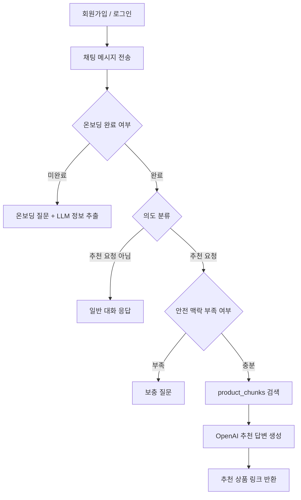

# Levit Assignment

AI 건강기능식품 추천/요약 에이전트 과제용 레포지토리입니다.

배포 링크: http://15.165.161.168

이번 과제에서는 한국의 35-50세 여성 소비자가 건강기능식품을 탐색할 때 느끼는 정보 탐색 비용과 불안감을 문제로 잡았습니다. 상품 상세 페이지, 리뷰, 성분 정보, 주의사항이 흩어져 있고 광고성 정보도 많기 때문에, 사용자가 “나한테 맞는 상품인지”를 빠르게 판단하기 어렵다고 보았습니다.

그래서 React, Node.js, MySQL, LangGraph.js, OpenAI API, RAG를 사용해 채팅형 추천 MVP를 구현했습니다. 유저는 회원가입/로그인 후 채팅방에서 자신의 건강 맥락을 온보딩으로 남기고, 이후 질문을 하면 수집한 상품 데이터와 개인 맥락을 함께 사용해 답변을 받습니다.

---

## 과제 요구사항 대응

| 요구사항 | 구현 내용 |
| --- | --- |
| React 사용 | `client/`에서 React 기반 채팅 UI 구현 |
| Node.js 사용 | `server/`에서 Express 기반 API 서버 구현 |
| ChatGPT API 활용 | 온보딩 정보 추출, 의도 분류, 추천 답변 생성에 OpenAI API 사용 |
| 크롤링 데이터 활용 | Pillyze 상품 HTML을 구조화한 `data/raw_products.json`을 Python pipeline으로 MySQL에 적재 |
| 사용자에게 콘텐츠 노출 | RAG가 `product_chunks`를 검색하고, 추천 답변과 상품 링크를 반환 |
| 호스팅 | EC2 단일 인스턴스에서 Docker Compose + nginx로 배포 |
| Github 제출 | 구현 의도와 실행 방법을 README/docs에 정리 |

---

## 핵심 기능

- 이메일 기반 회원가입/로그인
- JWT 기반 인증
- 채팅방 목록 조회와 메시지 조회
- 4단계 온보딩
  - 연령대/건강 고민
  - 임신/수유 및 지속 질환
  - 복용 중인 약/영양제
  - 생활패턴/주의 성분/섭취 선호
- LangGraph.js 기반 채팅 분기
  - 온보딩 미완료면 온보딩 질문
  - 온보딩 완료 후 추천 요청이면 RAG 검색
  - 추천 요청이 아니면 일반 대화 응답
  - 안전 맥락이 부족하면 보충 질문
- 상품 chunk 기반 RAG
- 추천 상품명, 브랜드, 원문 URL 반환
- Python 기반 상품 데이터 적재 pipeline

---

## Project Structure

```text
client/                 React chat UI
server/                 Node.js API server
pipeline/               Python product ingestion pipeline
data/raw_products.json  수집/구조화한 상품 데이터
deploy/nginx.conf       EC2 배포용 nginx reverse proxy 설정
docs/                   과제 설명 문서
```

서버는 기능 단위에 가깝게 나누었습니다.

```text
server/src/
├── domain
│   ├── auth
│   ├── chat
│   ├── onboarding
│   ├── product
│   ├── rag
│   └── user
└── global
    ├── config
    ├── db
    ├── llm
    └── vector
```

---

## 전체 흐름



## 문서

- [docs/01_Product_Strategy.md](./docs/01_Product_Strategy.md): 과제 1 문제 정의와 MVP 전략
- [docs/02_RAG_Architecture.md](./docs/02_RAG_Architecture.md): LangGraph/RAG 구조
- [docs/03_Data_Pipeline.md](./docs/03_Data_Pipeline.md): 상품 데이터 수집과 chunk 생성 방식
- [docs/04_API_Spec.md](./docs/04_API_Spec.md): API 명세와 채팅 API 흐름
- [docs/05_Deployment.md](./docs/05_Deployment.md): 배포 방향과 EC2 구성
- [docs/06_Runbook.md](./docs/06_Runbook.md): 로컬 실행, 데이터 적재, 배포, 테스트 방법

---

## 구현하면서 중요하게 본 점

첫 번째는 온보딩과 추천을 분리한 점입니다. 처음부터 상품 추천으로 들어가면 사용자의 질환, 복용약, 임신 여부 같은 맥락을 놓칠 수 있기 때문에, 최소한의 질문을 먼저 받도록 했습니다.

두 번째는 추천 요청이 아닌 말까지 RAG로 보내지 않도록 한 점입니다. 테스트 중에 사용자가 “왜 똑같이 말해?”처럼 말해도 계속 추천 답변이 반복되는 문제가 있었고, 그래서 LangGraph에 의도 분류 노드를 추가했습니다.

세 번째는 크롤링 자체보다 “수집한 데이터가 실제 답변에 쓰이는지”를 우선한 점입니다. 그래서 URL crawler를 깊게 만들기보다는, HTML에서 상품 정보를 구조화한 뒤 pipeline으로 DB에 넣고 RAG에서 사용하는 흐름을 먼저 완성했습니다.

---

## 한계와 개선 방향

- 현재 상품 데이터가 많지 않아 추천 품질 검증에는 한계가 있습니다.
- vector store가 인메모리라서 데이터 import 후 서버 재시작이 필요합니다.
- 웹검색 분기는 아직 구현하지 않았습니다. 추가하면 DB에 없는 최신 상품이나 성분 정보를 보강할 수 있지만, 광고성 정보 필터링과 출처 신뢰도 관리가 필요합니다.
- 건강기능식품은 의료 판단으로 오해될 수 있으므로, 답변은 구매 판단 보조 수준으로 제한했습니다.
