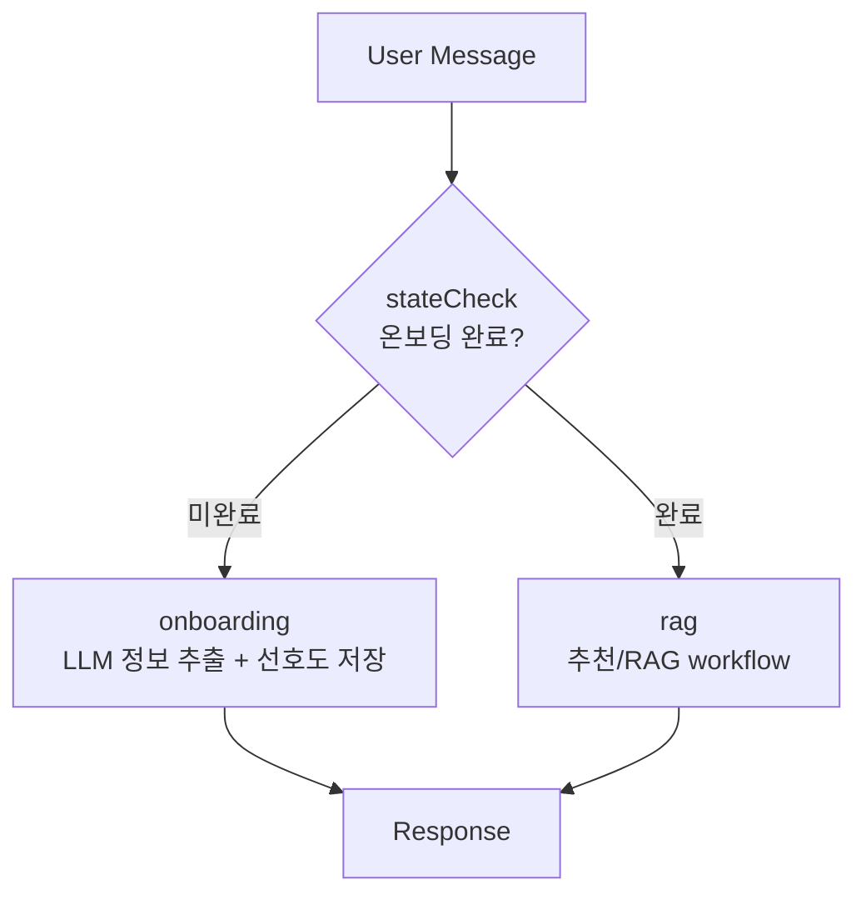
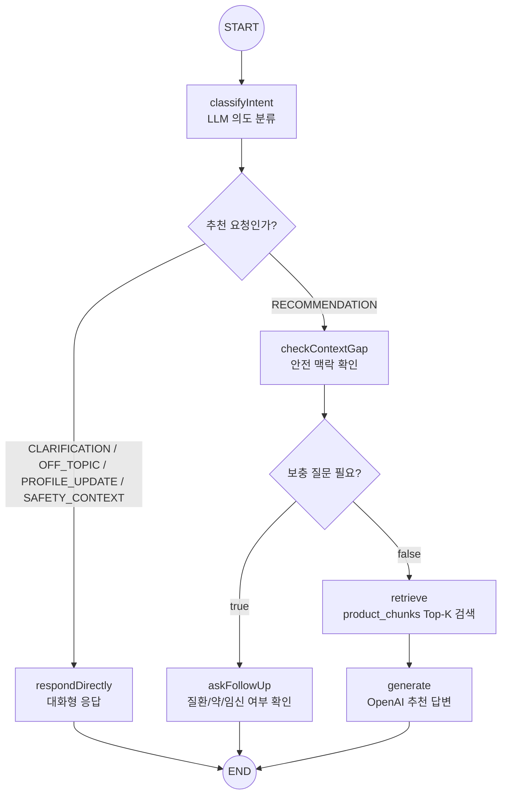
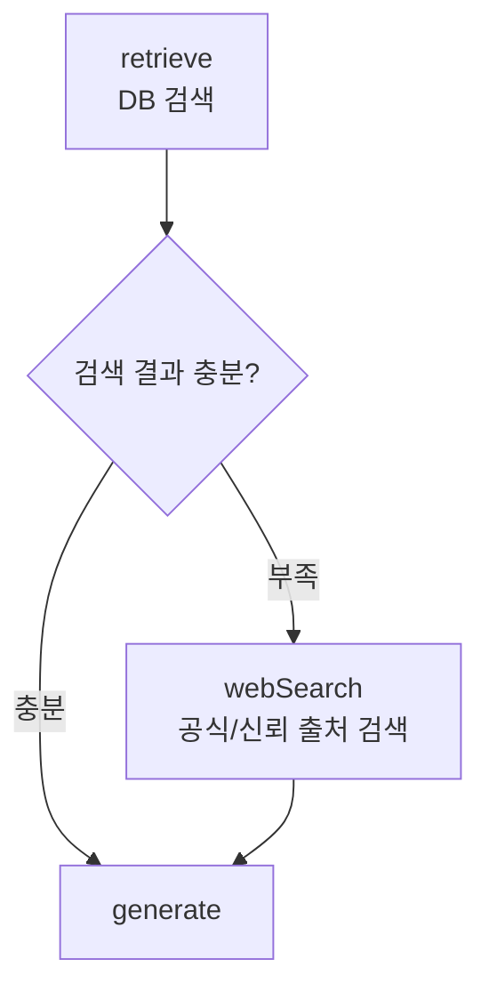

# RAG Architecture & AI Agent Workflow

## 1. Overview

본 프로젝트의 AI 에이전트는 `@langchain/langgraph`를 활용한 상태 기반 workflow로 설계했습니다.
단순히 유저 질문을 LLM에 그대로 전달하는 방식이 아니라, 온보딩 완료 여부, 대화 의도, 안전 맥락, 상품 데이터 검색 결과에 따라 노드를 나누었습니다.

최종 목표는 건강기능식품을 구매하려는 유저에게 “나에게 맞는지”, “주의할 점은 무엇인지”, “어떤 상품을 보면 되는지”를 짧은 대화 안에서 알려주는 것입니다.

---

## 2. 전체 채팅 흐름

채팅은 크게 두 개의 workflow로 나누었습니다.

`ChatTurnWorkflow`는 상위 분기 역할을 합니다.

1. `stateCheck`
   - 온보딩 완료 여부를 확인합니다.
   - 완료되지 않았다면 온보딩 노드로 보냅니다.
   - 완료되었다면 RAG 노드로 보냅니다.
2. `onboarding`
   - 유저의 자연어 답변에서 연령대, 성별, 건강 고민, 임신/질환/복용약, 생활패턴 등을 추출합니다.
   - OpenAI JSON 추출을 먼저 사용하고, 실패 시 로컬 파서로 fallback합니다.
3. `rag`
   - 온보딩으로 저장된 유저 맥락과 현재 질문을 같이 사용해 추천 workflow를 실행합니다.

---

## 3. RAG 내부 workflow

온보딩이 끝난 뒤에는 `ChatRagWorkflow`가 동작합니다.

### 노드 설명

#### `classifyIntent`

현재 메시지가 상품 추천 요청인지 먼저 분류합니다.

의도 값은 아래처럼 사용합니다.

| intent | 의미 | 다음 흐름 |
| --- | --- | --- |
| `RECOMMENDATION` | 상품 추천이나 비교가 필요한 요청 | `checkContextGap` |
| `CLARIFICATION` | 이전 답변 설명 요청 | `respondDirectly` |
| `PROFILE_UPDATE` | 유저 정보가 바뀌었다는 말 | `respondDirectly` |
| `SAFETY_CONTEXT` | 질환/약/임신 등 안전 맥락 공유 | `respondDirectly` |
| `OFF_TOPIC` | 추천과 관련 없는 대화 | `respondDirectly` |

이 노드는 테스트하면서 추가한 부분입니다. 초기에는 모든 메시지가 RAG 검색으로 흘러가서, 사용자가 “왜 똑같이 말해?”라고 해도 비슷한 추천 답변이 반복되었습니다. 그래서 추천 요청이 아닌 말은 검색하지 않고 대화형 응답으로 처리하도록 바꾸었습니다.

#### `respondDirectly`

상품 검색 없이 자연스럽게 대화합니다.
다만 상품명, 가격, 효능을 새로 지어내지 않도록 프롬프트에서 제한했습니다. 

#### `checkContextGap`

현재 질문에 혈압약, 당뇨약, 갑상선약, 임신/수유, 지속 질환 같은 안전 관련 맥락이 새로 등장했는지 확인합니다.
기존 온보딩 정보에 없는 중요한 안전 맥락이면 바로 추천하지 않고 `askFollowUp`으로 보냅니다.

건강기능식품은 의료 판단처럼 보일 수 있어서, 애매하면 추천보다 확인 질문을 먼저 하는 쪽으로 잡았습니다.

#### `askFollowUp`

복용 중인 약, 진단받은 질환, 임신/수유 여부를 추가로 묻습니다.
유저가 충분히 답하면 이후 메시지에서 다시 RAG 흐름을 탈 수 있습니다. 

*이때, 정해진 키워드에 대한 응답만을 기다리기에 제한된 유저의 응답방식을 요구하고 있습니다.*

#### `retrieve`

`유저 질문`과 `온보딩 정보`를 합쳐 검색 쿼리를 만듭니다.
MySQL에서 로딩한 `product_chunks`를 인메모리 vector store에 올려두고 유사도 검색을 수행합니다.

검색은 chunk 단위로 하지만, 최종 답변에는 같은 상품의 `summary`, `ingredients`, `claims`, `cautions`, `reviews`를 함께 넣습니다. 예를 들어 `claims` chunk가 검색되면 그 상품의 주의사항과 리뷰까지 같이 보고 답변하게 됩니다.

#### `generate`

OpenAI API에 유저 맥락과 상품 근거를 넣어 최종 답변을 생성합니다.
답변은 추천 이유, 주의할 점, 참고 근거, 추가 확인 질문이 드러나도록 프롬프트를 구성했습니다.

---

## 4. 조건부 엣지 정리

현재 구현된 조건부 엣지는 아래와 같습니다.

| 위치 | 조건 | 다음 노드 |
| --- | --- | --- |
| `ChatTurnWorkflow.stateCheck` | 온보딩 미완료 | `onboarding` |
| `ChatTurnWorkflow.stateCheck` | 온보딩 완료 | `rag` |
| `ChatRagWorkflow.classifyIntent` | `RECOMMENDATION` | `checkContextGap` |
| `ChatRagWorkflow.classifyIntent` | 그 외 의도 | `respondDirectly` |
| `ChatRagWorkflow.checkContextGap` | 안전 정보 부족 | `askFollowUp` |
| `ChatRagWorkflow.checkContextGap` | 정보 충분 | `retrieve` |

- 추천 요청이 아닌 메시지는 RAG 검색을 하지 않도록 합니다
- 안전 맥락이 부족하면 바로 추천하지 않고 보충 질문하도록 수정합니다.
- 검색된 chunk만 LLM에 넣지 않고, 같은 상품의 다른 chunk도 함께 넣도록 수정합니다.

---

## 5. threshold 설정

RAG 검색 결과에는 `minSimilarityScore = 0.2`를 적용했습니다.

초기 로컬 임베딩과 상품 데이터 수가 적은 상태에서 threshold를 너무 높이면 추천이 거의 나오지 않았고, 너무 낮추면 관련 없는 상품도 추천 근거로 들어왔습니다.

그래서 현재는 “약한 매칭은 버리되, 소규모 데이터셋에서 결과가 완전히 사라지지는 않는 값”으로 0.2를 사용했습니다.
상품 수가 늘어나면 아래 기준으로 다시 조정하는 것이 맞습니다.

- 질문별 Top-K 검색 결과의 정답 포함률
- 추천 답변에서 근거 상품이 실제 질문과 맞는 비율
- 검색 결과 없음 비율
- 추천 상품 링크 클릭률

현재 Top-K는 3으로 두었습니다. 답변에 넣는 근거가 너무 많아지면 LLM이 핵심을 흐릴 수 있고, 너무 적으면 비교가 어렵기 때문에 MVP에서는 3개로 설정하였습니다.

---

## 6. 프롬프트 전략

프롬프트는 한 번에 모든 역할을 맡기지 않고 용도별로 나누었습니다.

1. **온보딩 정보 추출**
   - 자연어 답변에서 연령대, 건강 고민, 질환, 복용 약, 생활패턴을 JSON으로 추출합니다.
   - 키워드가 정확히 맞지 않아도 “아침에 일어나기 힘들다”, “밤에도 자주 깬다” 같은 표현을 피로/수면 고민으로 저장할 수 있습니다.

2. **의도 분류**
   - 현재 메시지가 추천 요청인지, 설명 요청인지, 오프토픽인지 판단합니다.
   - 이 단계는 JSON으로 응답하도록 제한했습니다.

3. **추천 답변 생성**
   - 상품 근거와 유저 맥락을 넣고 답변합니다.
   - 진단, 치료, 처방처럼 단정하지 않도록 시스템 프롬프트에서 제한했습니다.

4. **대화형 응답**
   - 상품 검색이 필요 없는 메시지에는 별도 프롬프트로 짧게 응답합니다.
   - 이때 상품명, 가격, 효능을 새로 만들어내지 않도록 제한했습니다.

---

## 7. 개선 사항

현재 구현에는 웹검색 분기가 들어가 있지 않습니다.

넣는다면 자연스러운 위치는 `retrieve` 이후입니다.

웹검색을 추가하면 DB에 없는 최신 상품이나 성분 정보를 보강할 수 있습니다.
특히 상품 데이터가 적은 초반에는 “검색 결과 없음”을 줄일 수 있고, 특정 성분에 대한 최신 정보도 참고할 수 있습니다.

추후에는 식약처, 제품 공식 페이지, 검증된 상품 DB처럼 신뢰 가능한 출처를 우선 검색하고, 검색 결과의 출처를 답변에 함께 노출하는 방식이 적절해 보입니다.

---

## 8. 현재 한계와 확장 방향

- 현재 vector store는 인메모리이기 때문에 상품 데이터를 새로 import하면 API 서버 재시작이 필요합니다.
- 운영 단계에서는 Qdrant, pgvector, Pinecone 같은 외부 vector store로 분리하는 것이 좋습니다.
- 상품 데이터가 아직 적기 때문에 추천 품질 검증에는 한계가 있습니다.
- 안전 관련 질문은 보수적으로 처리했지만, 의료 판단이 필요한 영역은 전문가 상담 안내를 유지해야 합니다.
