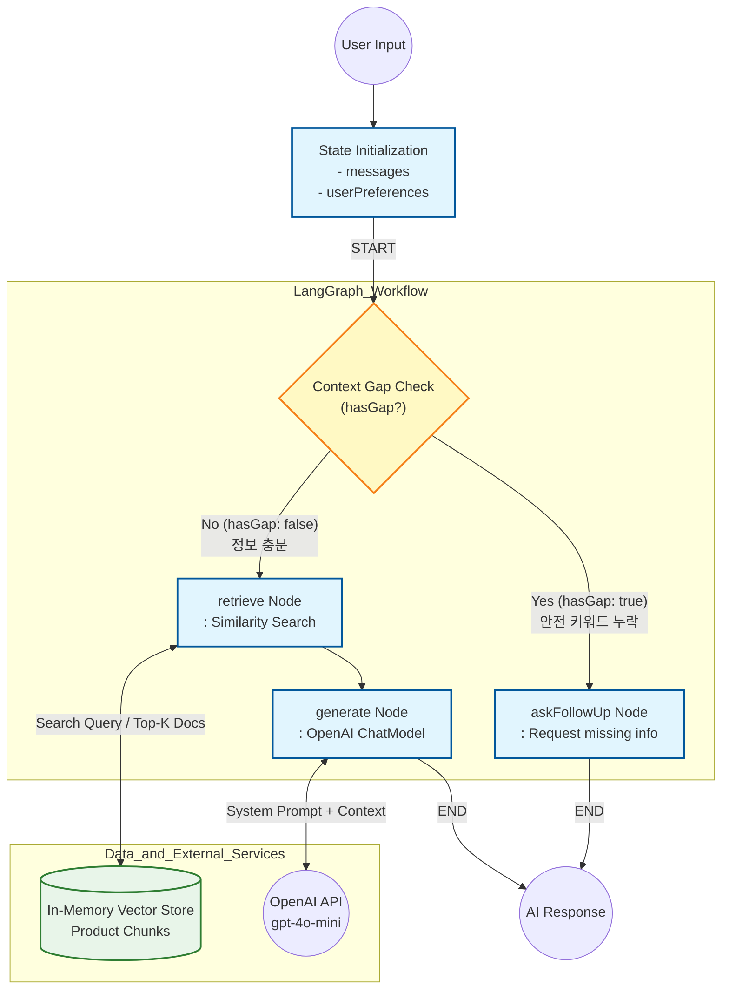

# RAG Architecture & AI Agent Workflow

## 1. Overview
본 프로젝트의 AI 에이전트는 `@langchain/langgraph`를 활용한 상태 기반 워크플로우(StateGraph)로 설계되었습니다. 단순한 1-Depth 질의응답을 넘어, 유저의 현재 컨텍스트(온보딩 여부, 기저질환, 복용 약물)를 추적하고 정보가 부족할 경우 선제적으로 질문을 던져 안전하고 초개인화된 추천을 제공합니다.

---

## 2. 워크플로우

에이전트의 흐름은 `ChatRagWorkflow` 내에 정의된 노드와 조건부 엣지를 따라 다음과 같이 제어됩니다.

1. **User Input & State Initialization (시작점)**
   - 유저의 메시지, `userId`), 온보딩을 통해 수집된 취향/건강 상태(`userPreferences`)를 State에 적재합니다.
2. **Context Gap Check (`checkContextGap` Node)**
   - 유저의 질문 내용 중 민감한 건강 키워드(혈압약, 당뇨약, 임신 등)가 포함되어 있는지 파악합니다.
   - **조건부 분기:** 해당 키워드가 존재하지만 유저의 기존 State(`userPreferences`)에 관련 정보가 없다면 `askFollowUp` 노드로, 정보가 충분하다면 `retrieve` 노드로 라우팅합니다.
3. **Missing Context Handling (`askFollowUp` Node)**
   - 추천의 안전성을 담보하기 위해 LLM 생성을 보류하고, 유저에게 현재 복용 중인 약이나 임신/수유 여부를 추가로 묻는 답변을 즉시 반환하여 온보딩을 재진행합니다.
4. **Vector Retrieval (`retrieve` Node)**
   - 유저의 질문과 온보딩 데이터를 결합하여 풍부한 검색 쿼리를 생성합니다.
   - In-Memory Vector Store에 적재된 `product_chunks`의 임베딩 값과 유사도를 측정하여 가장 적합한 상품 정보 및 리뷰 근거를 추출합니다.
5. **Answer Generation (`generate` Node)**
   - 검색된 상품 근거 Document와 유저의 헬스케어 맥락을 OpenAI API 모델(`gpt-4o-mini`)의 System Prompt로 주입합니다.
   - [추천 요약, 추천 이유, 주의할 점]의 고정된 포맷으로 가공된 최종 API 응답을 반환합니다.

---

## 3. 프롬프트 엔지니어링 전략

본 프로젝트는 크롤링된 대용량의 상품 데이터와 유저의 가변적인 개인화 맥락을 LLM이 오염 없이 이해하도록 합니다.

### 1) 구조화된 컨텍스트 주입 
유저의 질문과 결합된 영양제 상세 정보 및 리뷰 데이터를 단순 줄글로 던질 경우, LLM이 혼동할 우려가 있습니다. 이를 방지하기 위해 백엔드에서 `제목: {title} \n 내용: {content}` 형태로 템플릿화하여 `System Prompt`와 명확히 분리된 `User Prompt` 를 주입했습니다.

### 2) 명확한 섹션 규정 및 포맷 제어
`createRecommendationFormatInstruction()` 모듈을 통해 출력 포맷을 통제합니다. 
- 단정적 진단 행위를 금지하는 페르소나 설정(`너는 건강기능식품 구매 판단을 돕는 AI 에이전트다. 진단, 치료, 처방처럼 단정하지 말 것`)
- 출력 결과물의 가독성을 극대화하기 위해 미리 정의된 5대 섹션(`추천 요약`, `추천 이유`, `주의할 점`, `참고 근거`, `추가 확인 질문`)의 타이틀을 그대로 사용하도록 강제하여 프론트엔드에서 파싱 및 UI 렌더링이 용이하도록 설계했습니다.

---

## 4. 아키텍처적 트레이드오프 고민

### Python vs Node.js
AI 및 RAG 파이프라인 구현 시, 사용할 언어를 고민했습니다. LangChain/LangGraph 생태계와 다양한 과학 연산 라이브러리가 내장된 **Python**을 사용하는 것을 고려했고, 실제로 최초 아키텍처 구상 단계에서는 분리된 파이썬 RAG 서버를 고려했습니다. 하지만 아래와 같은 이유로 **Node.js 단일 서버 내 RAG 구조**로 선회했습니다.

- **통신 비용 및 인프라 복잡도 가중:** 파이썬과 노드 서버 간의 실시간 컨텍스트 공유를 위해서는 gRPC나 Webhook 등의 통신 레이어가 추가로 필요합니다. 이는 3일이라는 한정된 마일스톤 내에 불가능하다고 생각했고, 작업량이 훨씬 증가합니다.

*만약 충분한 시간이 주어진다면, Python을 통해 구현하는 것이 책임 분리 측면에서 더 적절해보입니다.*
