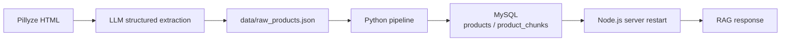

# Data Ingestion & RAG Chunking Pipeline

## 1. Overview

본 프로젝트의 데이터 파이프라인은 외부 상품 페이지에서 얻은 비정형 데이터를 RAG에 사용할 수 있는 `products`, `product_chunks` 형태로 바꾸는 역할을 합니다.

현재 흐름은 아래와 같습니다.



---

## 2. 왜 LLM 구조화 추출을 선택했는지

처음에는 URL을 입력하면 HTML 태그를 직접 파싱하는 crawler를 만들려고 했습니다. 이 방식은 몇가지 문제가 있습니다.
1. 각 사이트마다 챗봇이나 사이트 접근을 검증하는 보안 시스템에 의해 크롤링이 어려울 수 있습니다.
2. 각 사이트마다 html의 태그 구조가 재각각입니다.
3. 정보가 부족한 사이트의 데이터는 오히려 할루시네이션을 초래할 수 있습니다.

이번 과제에서 확인하고 싶은 핵심은 대규모 크롤러 구현이 아니라, **크롤링한 데이터가 AI 추천 근거로 연결되는지**라고 보았습니다.
그래서 아래 방식으로 범위를 줄였습니다.

1. 상품 페이지 HTML 원문을 확보합니다.
2. AI에게 정해진 JSON 스키마로 정보 추출을 요청합니다.
3. 사람이 한 번 확인한 `raw_products.json`을 pipeline에 넣습니다.
4. pipeline이 정규화, chunk 생성, MySQL 적재를 담당합니다.

---

## 3. pipeline 모듈

```text
JsonFileProductSource (Json 기반 상품 데이터)
  -> normalize_products (상품 데이터 정규화)
  -> build_chunks_for_products (의미 섹션 기반 청크화)
  -> DbApiProductWriter (디비에 저장)
```

### `crawler.py`

현재는 실제 네트워크 crawler가 아니라 JSON 파일 입력 source 역할을 합니다.
`data/raw_products.json`을 읽어 pipeline에 넘깁니다.

### `normalizer.py`

외부에서 들어온 raw JSON을 내부 `Product`, `Ingredient`, `Review` 구조로 정규화합니다.
필수 값이 없으면 `raw_products[index]` 위치를 포함해 에러를 냅니다.

### `chunker.py`

상품 정보를 의미 섹션 단위로 나눕니다.
이렇게 나누면 유저 질문이 “주의사항”, “리뷰”, “성분” 중 어떤 맥락에 가까운지 검색하기 쉬워집니다.

### `writer.py`

정규화된 상품과 chunk를 MySQL에 저장합니다.
RAG에서 상품 원문으로 이동할 수 있도록 `source_url`도 함께 유지합니다.

---

## 4. Chunk 생성 기준

| 입력 필드 | 생성된 `chunk_type` | 생성 조건 |
| --- | --- | --- |
| `name`, `brand`, `price`, `reviews` | `summary` | 항상 생성 |
| `ingredients` | `ingredients` | 성분이 1개 이상 있을 때 |
| `claims` | `claims` | 기능성/특징 문구가 있을 때 |
| `cautions` | `cautions` | 주의사항 문구가 있을 때 |
| `reviews` | `reviews` | 리뷰가 1개 이상 있을 때 |

각 chunk의 metadata에는 `product_name`, `brand`, `source_url`, `source_product_id`, `chunk_index`를 넣습니다.
RAG 검색 후 추천 상품 링크를 프론트엔드에서 보여줄 수 있도록 `source_url`을 유지하는 것이 중요했습니다.

---

## 6. 개선 사항

- **자동화 수준 개선:** 현재는 HTML 원문을 AI로 구조화한 뒤 사람이 확인하는 방식입니다. 추후에는 URL 입력, HTML 수집, LLM 추출, 검수 큐까지 이어지는 형태로 자동화할 수 있습니다.
- **출처 신뢰도 관리:** 건강기능식품은 광고성 정보가 많기 때문에, 공식 상품 페이지나 신뢰 가능한 기관 데이터를 우선 사용하는 정책이 필요합니다.
- **Vector DB 분리:** 현재는 API 서버 시작 시 인메모리 vector store를 구성합니다. 운영 단계에서는 외부 vector DB로 분리해 import 직후 검색에 반영되도록 개선할 수 있습니다.
- **데이터 품질 검수:** LLM 추출 결과가 잘못될 수 있으므로, 필수 필드 누락, 가격/성분 형식, 리뷰 길이 등을 자동 검수하는 단계가 필요합니다. 추가로 추천 품질을 검증하는 도구를 통해 품질 점수를 객관적인 지표로 확인할 수 있습니다.
