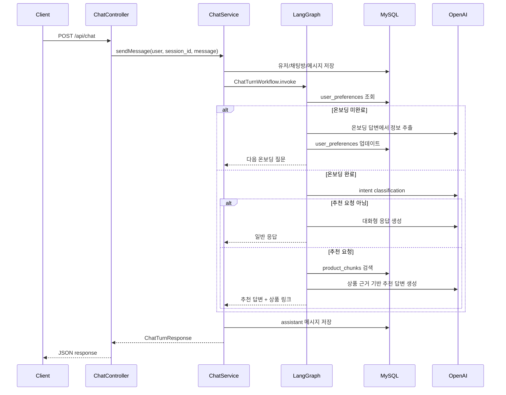

# API Spec

## 1. Overview

서버는 REST API로 구성했습니다.
프론트엔드는 모든 채팅 기능을 API로만 사용하고, 서버는 인증된 유저 기준으로 채팅방과 메시지를 관리합니다.

---

## 2. 인증 방식

회원가입과 로그인 응답으로 JWT token을 반환합니다.
인증이 필요한 API는 아래 header를 붙여 요청합니다.

```http
Authorization: Bearer <token>
```

토큰이 없거나 유효하지 않으면 `401`을 반환합니다.

---

## 3. Auth API

### `POST /api/auth/signup`

회원가입 API입니다.

#### Request

```json
{
  "email": "hello@gmail.com",
  "nickname": "hello",
  "password": "password123"
}
```

#### Response

```json
{
  "token": "jwt-token",
  "user": {
    "id": 1,
    "email": "hello@gmail.com",
    "nickname": "hello"
  }
}
```

#### Error

- `400`: email, nickname, password 누락 또는 password 8자 미만
- `409`: 이미 가입된 email

---

### `POST /api/auth/login`

로그인 API입니다.

#### Request

```json
{
  "email": "hello@gmail.com",
  "password": "password123"
}
```

#### Response

```json
{
  "token": "jwt-token",
  "user": {
    "id": 1,
    "email": "hello@gmail.com",
    "nickname": "hello"
  }
}
```

#### Error

- `401`: email 또는 password가 맞지 않음

---

## 4. Chat API

채팅 API는 로그인 필수입니다.

### `GET /api/chat/sessions`

유저의 채팅방 목록을 조회합니다.

#### Response

```json
{
  "sessions": [
    {
      "id": 19,
      "title": "요새 졸리다잉",
      "created_at": "2026-05-30T05:00:00.000Z",
      "updated_at": "2026-05-30T05:10:00.000Z"
    }
  ]
}
```
---

### `GET /api/chat/sessions/:sessionId/messages`

특정 채팅방의 메시지를 조회합니다.

#### Response

```json
{
  "session": {
    "id": 19,
    "title": "요새 졸리다잉",
    "created_at": "2026-05-30T05:00:00.000Z",
    "updated_at": "2026-05-30T05:10:00.000Z"
  },
  "messages": [
    {
      "id": 100,
      "session_id": 19,
      "role": "user",
      "content": "요즘 피곤하고 잠도 잘 못 자요",
      "metadata": {},
      "created_at": "2026-05-30T05:00:00.000Z"
    }
  ]
}
```

---

### `POST /api/chat`

채팅 메시지를 전송합니다.
`session_id`가 없으면 새 채팅방을 만들고, 있으면 기존 채팅방에 메시지를 추가합니다.

#### Request

```json
{
  "session_id": 19,
  "message": "40대 여성이고 요즘 피곤하고 수면이 고민이에요"
}
```

#### Response

```json
{
  "user_id": "1",
  "session_id": 19,
  "is_onboarding_completed": true,
  "next_action": "RESPOND",
  "message": "현재 맥락에서는 ...",
  "retrieved_document_ids": ["product-chunk-21"],
  "recommendations": [
    {
      "name": "BNR17 다이어트 유산균 비에날씬",
      "brand": "에이스바이옴",
      "source_url": "https://www.pillyze.com/products/559/BNR17-다이어트-유산균-비에날씬"
    }
  ]
}
```

---

## 5. Chat API Flow

`POST /api/chat`은 단순히 LLM을 호출하는 API가 아니라, 유저 상태에 따라 다른 흐름을 탑니다.



1. 사용자의 온보딩 완료 여부에 따라 분기가 나뉩니다.
   - 온보딩을 완료하지 않았다면, 온보딩 과정 이후 다음 플로우를 진행합니다.
2. 사용자의 응답이 추천 요청과 관련되지 않다면, 대화가 가능한 응답을 보낼 수 있도록 합니다.
3. 추천 요청과 관련된다면, 임베딩한 데이터를 기반으로 유저에게 추천할 상품을 추출하고 상품에 대한 소개와 응답을 전달합니다.