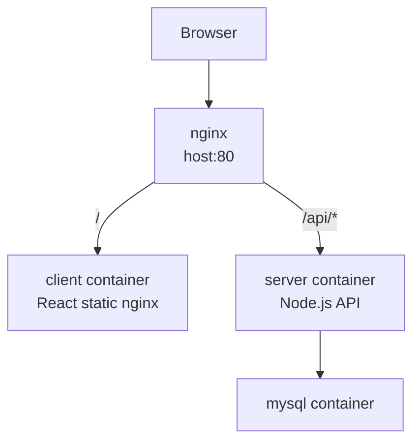

# Deployment

## 1. 배포 방향

이번 과제 제출용 배포는 EC2 단일 인스턴스에서 모두 실행하는 방향으로 잡았습니다.

이 방식은 구조가 단순하고, CORS 설정도 줄어들기에 과제의 요구사항을 충분히 만족한다고 판단했습니다.

---

## 2. 현재 배포 구조

---

## 3. Docker Compose 역할

### `mysql`

- MySQL 8 컨테이너
- API 서버가 사용하는 데이터 저장소
- 로컬 import를 위해 EC2 내부 `127.0.0.1:3306`에만 열어둡니다.
- 외부 인터넷에 DB 포트를 직접 열지 않습니다.

### `server`

- Node.js API 서버
- Express, LangGraph.js, OpenAI API, MySQL repository를 사용합니다.
- 외부에 직접 포트를 열지 않고 nginx를 통해 접근합니다.

### `client`

- React build 결과물을 nginx로 서빙합니다.
- 배포에서는 `VITE_API_BASE_URL`을 비워 같은 origin의 `/api`를 바라보게 합니다.

### `nginx`

- EC2의 80번 포트를 받습니다.
- `/`는 client로 보냅니다.
- `/api`, `/health`는 server로 보냅니다.

현재는 과제 제출 시점의 단순성과 재현성을 우선했습니다.
